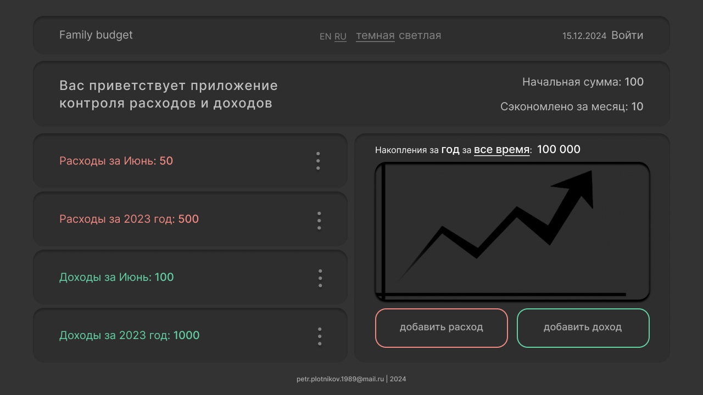

# Приложение для учета расходов и доходов
# Application for tracking expenses and income

## Описание
В планах разработка удобного, простого и быстрого    приложения, для контроля расходов и доходов.  
С возможностью просмотра и сравнения данных,  
полученных за год, за месяц и за все время  
в виде графиков
## Технологии
Бекенд микросервисы на Go  
Фронтенд React, TypeScrypt
## Требования
## Установка и Запуск
## Использование
## Авторы
Пётр Плотников 
[мой Телеграмм @petr_plot](https://t.me/petr_plot)
>
<petr.plotik@gmail.com>

